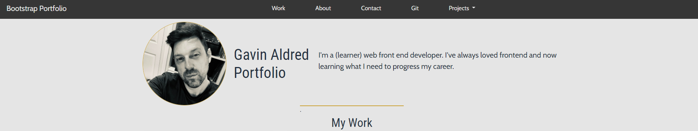

# Gavin Aldred Boostrap-portfolio
## Description

A Bootsrap portfolio of work to showcase my skills and talents to employers. 
Uses boostrap for nav, cards and main layoutFollows semantic HTML best practice and uses comments to guide CSS reading.

## Installation

N/A

## Usage

View the completed project below on the deployed link. A screenshot has also been added.

 
  

   

[Link to the finished deployed website](https://gavinaldred.github.io/Bootstrap-Portfolio/)

## Credits

N/A

## License

Please refer to the LICENSE in the repo.

---

## Badges

